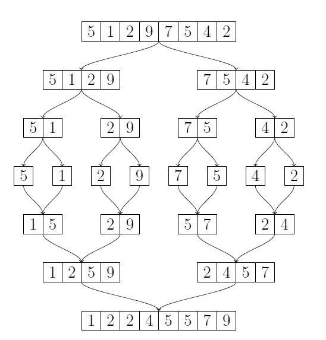

# Recursion

When we have *recursion*, a method is calling itself. A recursion must end at some point (it should not have an endless loop). The ending criteria is called a *base case*. It does not call the method and ensures the recursion will end.

Recursion is an effective way to represent a complicated algorithms function and logic, although understanding and using recursion takes a bit of practice.

Here's a simple example of how recursion works. Below are more useful examples. Let's have a real number *x* and a natural number *n*. We know, that 

x^n = 1, if n = 0  
x^n = x * x^(n-1), if n > 0

In this case, the n = 0 is the base case, which directly includes the solution. We can write this into a program:

```cs
public static double Power(double x, int n)
{
  if (n == 0)
  {
    return 1;
  }
  return x * Power(x, n - 1);
}
```
What happens, when we call for example **Power(2.0, 4)**? On mathemathical level, something like this:


2^4 =  
2 * 2^3 =  
2 * (2 * 2^2) =  
2 * (2 * (2 * 2^1)) =  
2 * (2 * (2 * (2 * 2^0))) =  
2 * (2 * (2 * (2 * 1))) =  
2 * (2 * (2 * 2)) =  
2 * (2 *4) =  
2 * 8 =  
16  


Notice, how the recursion "expands" until we reach *n = 0* and then "rewinds" as we calculate the values one by one.

The method has a *run-time stack*, where all this information is stored, until we reach the very end. Basically it means having all the information in the computer memory. As we get into larger examples, the size of the stack might become quite large, and we might run out of memory.

## Single call

The simplest situation is when a method calls itself only once. For example:


```cs
static void Test(int n)
{
  Console.Write(n + " ");
  // The base case
  if (n == 1) return;
  // The recursive call
  Test(n - 1);
}

static void Main(string[] args)
{
  Test(10);
}
```

Here the method **Test** first prints the value for parameter *n*. If n is 1, the method does not continue to run, it ends. Otherwise the method calls itself with a one smaller parameter, *n - 1*. The example print is as follows:

```console
10 9 8 7 6 5 4 3 2 1 
```

## Multiple calls

The situation becomes more interesting, when a mehtod calls itself multiple times. The following code is otherwise equal to the previous one, but the now at the end we have *two* recursive calls:

```cs
static void Main(string[] args)
{
  Test(4);
}

static void Test(int n)
{
  Console.Write(n + " ");
  if (n == 1) return;
  Test(n - 1);
  Test(n - 1);
}
```

Now the example print is as follows:

```console
4 3 2 1 1 2 1 1 3 2 1 1 2 1 1
```

## Stack size

The next method **Sum** calculates the sum *1 + 2 + 3 ... + n* with recursion.

```cs
static void Main(string[] args)
{
  Console.WriteLine(Sum(10)); // 55
}

static long Sum(int n)
{
  if (n == 0) return 0;
  else return Sum(n - 1) + n;
}
```

Everything goes smoothly, when the *n* is small, but with large parameters (like one million), we get an error:

```console
Stack overflow.
```

The reason for this is that all the inner calls we make take space from a memory space, we call a **Stack**. The size of this value is by default limited, and if a recursion has many layers, we might run out of memory.

There are ways of getting around this problem, but those will not be taught in this course. Increasing stack size is not a valid solution. Rather we should make our code work without overflow.


## Example: Files

One reasonable use for recursion is to go through a folder with files in them. We will use the following structure in our example:

```console
test
├── 1.txt
├── 2.txt
├── mary
│   ├── 3.txt
│   ├── 4.txt
│   ├── banana
│   │   ├── 7.txt
│   │   └── 8.txt
│   ├── coconut
│   │   ├── 10.txt
│   │   └── 9.txt
│   └── monkey
│       ├── 5.txt
│       └── 6.txt
└── mike
    ├── 11.txt
    └── 12.txt
```

The following method **Examine** will go through the contents of a given folder. The *File object* given as a parameter can be either a file or a folder. If it is a folder, the method will recursively go through its content. If it is a file, the method will print its name.

```cs
static void Main(string[] args)
{
  Examine("test");
}

static void Examine(string path)
{
  // Check if the file is a directory
  // If the directory does not exist, it's a regular file
  // Or we have a wrong path, and we do not need to continue anyways
  if (Directory.Exists(path))
  {
    // For each file name in the directory
    // GetFileSystemEntries covers files and folders
    foreach (string fileName in Directory.GetFileSystemEntries(path))
    {
      // Recursively call the method
      Examine(fileName);
    }
  }
  // If the file is not a directory
  // Print the name
  else Console.WriteLine(path);
}
```

Our code prints as follows:

```console
test/1.txt
test/2.txt
test/mary/3.txt
test/mary/4.txt
test/mary/banana/7.txt
test/mary/banana/8.txt
test/mary/coconut/10.txt
test/mary/coconut/9.txt
test/mary/monkey/5.txt
test/mary/monkey/6.txt
test/mike/11.txt
test/mike/12.txt
```

## Iterative solutions

As you might have guessed, not everything is reasonable to create with recursion. In the beginning, we had a solution for calculating mathemathical powers with recursion. A more reasonable way could be for example:

```cs
public static double Power(double x, int n)
{
  double result = 1;
  for (int i = 1; i <= n; i++)
  {
    result *= x;
  }
  return result;
}
```

This solution takes up much less space (and is faster), since we do not need a recursion stack. In theory, every recusion can be changed into an iteration. There are solutions, of course, which are easier to explain in one way or the other.

Recursion is usually easier to understand and to create, and the code is shorter. It is, how ever, usually also slower, and takes up more memory space.

# Sorting algorithms

Sorting is an essential problem in algorithmics, where the problem is to sort *n* elements into order of magnitude. For example, we could have an array **\[5, 2, 4, 2, 6, 1\]** and we could sort the elements from smallest to largest, resulting in **\[1, 2, 2, 4, 5, 6\]**.

Our goal is to do this *efficiently*. It is easy to sort an algorithm in *O(n^2)*, but this is too slow on a large array. We will look into some efficient sorting algorithms, which only take *O(n log n)* time.

We can use sorting in many ways in algorithm design, because we can often make the problem solving easier by first orderding the data.

## Sorting in O(n^2)

Let's first see a simple sorting algorithm, which sorts an array with *n* elements in *O(n^2)* with two loops. Even though the algorithm is not fast, it is worth knowing and gives a base for designing more efficient algorithms.

## Insertion sort

*Insertion sort* goes through the array from left to right. When the algorithm comes into a certain point in array, it will move the element in that position to the correct position in the beginning of the array, so that the beginning of the array is in order. So, when the algorithm reaches the end, the whole array is sorted.


5 *2* | 4 2 6 1 --> *2* 5 | 4 2 6 1

2 5 *4* | 2 6 1 --> 2 *4* 5 | 2 6 1

2 4 5 *2* | 6 1 --> 2 *2* 4 5 | 6 1

2 2 4 5 *6* | 1 --> 2 2 4 5 *6* | 1

2 2 4 5 6 *1* | --> *1* 2 2 4 5 6 |


Here we see the insertation sort in action. In each row, the element marked with stars is moved into its correct position. The line marks the location of where the array is sorted upto. The following code will implement this sorting:

```console
for i = 1 to n-1
  j = i-1
  while j >= 0 and array[j] > array[j+1]
    swap(array[j], array[j+1])
    j -= 1
```

The code goes through all the positions *1...n-1* and transfers the element in position *i* to the correct position. This is done with the inner while-loop, where each step swaps the element and the one left of it. Here the command *swap* is a notation for switching the two elements together.

The efficiency of insertion sort is dependant on the content of the array we are sorting. The algorithm is faster, the more the array is already in order. If the array is already in order, it spends *O(n)*, since no element needs to be moved. The worst case for the algorithm is an array in *inverted order*, where each element has to be moved to the beginning of the array, and time spent is *O(n^2)*.

## Inversions

A useful term in analysation of sorting algorithms is *inversion*: two elements in an array, which are in wrong order. For example in array **\[3, 1, 4, 2\]** is three inversions: **(3,1)**, **(3,2)** and **(4,2)**. The amount of inversions tells about the order of the array: The less there are inversions, the closer the array is to being in correct order. Most notably, *an array is in order when it has no inversions*.

When a sorting algorithm sorts an array, it *removes* inversions. For example, each time the insertion sort swaps the two elements with each other, it is removing one insertion from the array. Thus the work load for insertion sort is equal to the amount of inversions in the array.

We have already established, that the worst input for insertion sort is a reverse ordered array. In an array like this each pair of elements create an inversion, so the amount of inversions is

n(n-1) / 2 = O(n^2)  

How well does the insertion sort work *on average*? If we assume that an array has *n* elements in random order, each pair of elements forms an inversion with the probability of 1/2. Thus the *expected value* for inversions is

n(n-1) / 4 = O(n^2)  

Which means we are still spending quadratic time. The reason why insertation sort is so *inefficient* is that it does not remove the inversions efficiently enough. If we want to create a better sorting algorithm, we have to design it in such a way, that it can remove multiple inversions *at the same time*. In practice, the algorithm should be able to move the element from the wrong position to the other side of the array *efficiently*.

## Sorting in O(n log n)

Next we will look into two efficient sorting algorithms, which are based on recursion. In both algorithms the idea is, that when we want to sort an array, we split it into two smaller parts and sort them recursively. After this we merge the sorted subarrays into a complete sorted array.

## Merge sort


source: [**Tietorakenteet ja algoritmit**](https://github.com/pllk/tirakirja/raw/master/tirakirja.pdf)

*Merge sort* is a recursive sorting algorith,. which is based on halving the array. When we get an array of size *n* to be sorted, we split it from the middle into two subarray, which both have aproximately *n/2* elements. After this we sort the subarrays and *merge* the sorted subarrays, so that they form a complete ordered array. Recursion ends at *n = 1*, when array is already in order and nothing more needs to be done. The following code shows the functionality of merge sort:

```console
sort(a,b)
  if a == b
    return
  k = (a+b)/2
  sort(a,k)
  sort(k+1,b)
  merge(a,k,k+1,b)
```

The method sorts the array *a...b* (a subarray from point *a* to point *b*), so if we want to order the whole array, we call the method with parameters *a = 0* and *b = n-1*, i.e. the first and the last index. First the method checks if the array only has one element, and if so, the method ends. Otherwise it will save the middle value into the variable *k* and sorts the left and right parts recursively. In the end, it will call the method *merge*, which combines the ordered halves. The next code shows the functionality of this method:

```console
merge(a1, b1, a2, b2)
  a = a1, b = b2
  for i = a to b
    if a2 > b2 or (a1 <= b1 and array[a1] <= array[a2])
      help[i] = array[a1]
      a1 += 1
    else
      help[i] = array[a2]
      a2 += 1
  for i = a to b
    array[i] = help[i]
```

As parameters are given values *a1...b1* and *a2...b2*, where *b1 + 1 = a2*. The method assumes, that the values between these have been ordered, and it will merge the elements in a way that the whole area *a1...b2* is ordered. The method is based on a loop, which goes through the *a1...b1* and *a2...b2* side by side, and chooses the always the next smallest element to the final order. For the merge not to mix the array, the method uses a global help array, where it first forms the sorted subarray, and then copies the elements from said array to the actual array.

The picture above shows how the algorithm works with an array **\[5, 1, 2, 9, 7, 5, 4, 2\]**. First the array is halved into **\[5, 1, 2, 9\]** and **\[7, 5, 4, 2\]** and it sorts both of these subarrays by calling itself. When the algorithm gets the array **\[5, 1, 2, 9\]** as a parameter, it will divide it into subarrays **\[5, 1\]** and **\[2, 9\]**, and so on. Eventually we will have subarrays of Length one left, which are in order. Then the rekursive division ends and the algorithm starts to reassemble the sorted subarrays from smallest to largest.

How efficient is merge sort? Since all the calls in the method *sort* half the size of the array, the recursion will form *O(log n)* layers (see the picture above). On the topmost layer we have an array with *n* elements, next level we have two arrays with *n/2* elements, next we have four arrays with *n/4* elements, and so on. The method *merge* functions in linear time, So on each level the merges take up *O(n)*. Thus the total time complexity of the algorithm is *O(n)* * *O(log n)*, which is of course *O(n log n)*.

## Quick sort